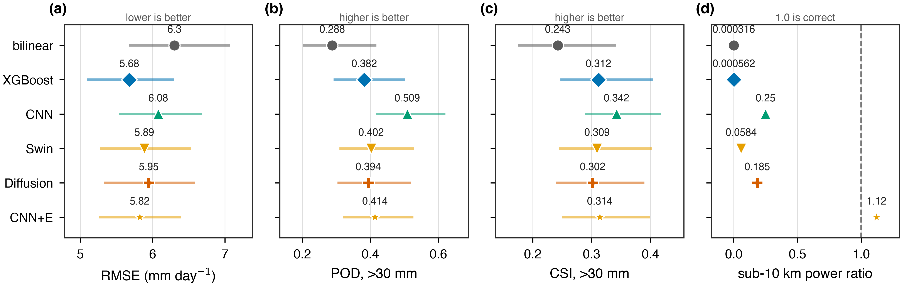
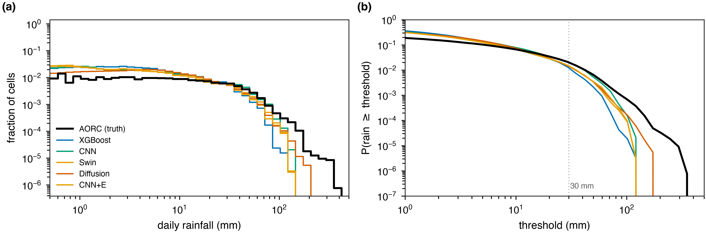
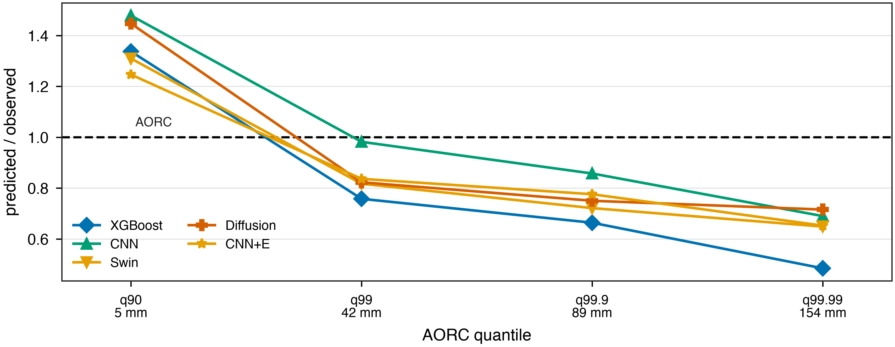
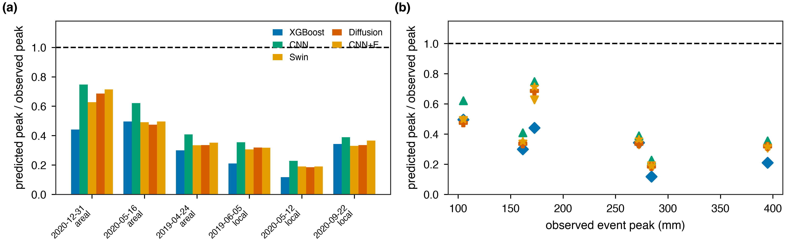
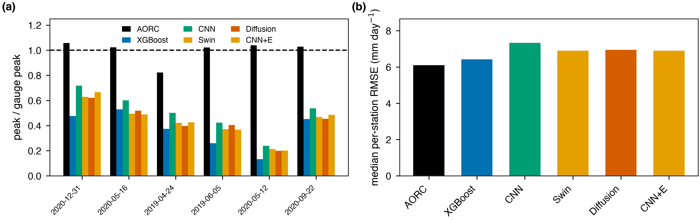
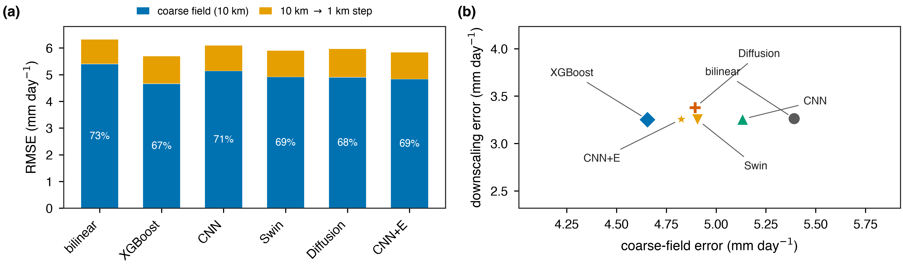

# Downscaling NASA POWER: 0.5° to 1 km

A plain-language summary of the POWER arm on its own. Everything here is the
2019–2020 test period over the Austin domain, which no model trained on.

Figures are in `results/figures/review_power/`. The companion document for the
IMERG arm is `PROJECT_SUMMARY.md`.

---

## 1. What POWER is, and why it is a different question

**NASA POWER is not a satellite product.** It serves `PRECTOTCORR` from MERRA-2, a
weather reanalysis — a physics model with observations assimilated into it — and the
precipitation is bias-corrected against CPC gauge data.

So this arm changes three things at once compared with the IMERG study:

| | IMERG | NASA POWER |
|---|---|---|
| what it is | satellite retrieval | **reanalysis** |
| resolution | 0.1° | **0.5° × 0.625°** |
| gauge information | adjusted in the Final Run | **CPC-corrected** |

That matters for how the results can be read. **This is not a controlled test of
resolution** — three variables move together. It is a test of whether the conclusions
from the IMERG arm survive a genuinely different kind of input.

**The scale difference is large.** One POWER cell covers **3,600** of our 1 km target
cells; one IMERG cell covers 144. The evaluation box holds about 42 POWER cells
against IMERG's 1,050. Far more real structure is destroyed before we start.

## 2. The products

| | RMSE | POD | CSI | KGE | texture |
|---|---|---|---|---|---|
| bilinear | 6.303 | 0.288 | 0.243 | 0.530 | 0.000 |
| **XGBoost** | **5.679** | 0.382 | 0.312 | 0.606 | 0.001 |
| CNN + texture penalty | 5.821 | 0.414 | 0.314 | **0.651** | **1.121** |
| Swin | 5.886 | 0.402 | 0.309 | 0.636 | 0.058 |
| Diffusion | 5.947 | 0.394 | 0.302 | 0.635 | 0.185 |
| CNN | 6.078 | **0.509** | **0.342** | 0.617 | 0.250 |

Every model beats interpolation, and by more than in the IMERG arm — XGBoost takes
6.303 down to 5.679, a **10 %** reduction against IMERG's 6.8 %. A worse input leaves
more for a correction to fix.

**`CNN + texture penalty` reaches a texture of 1.121**, where 1.0 is correct. That is
the closest to realistic fine-scale structure of any product in either arm, from a
0.5° input. Whatever else is limited here, the *realism* of the field is not.

## 3. The distributions are badly wrong

Real rain falls on **28 %** of cells. The products say **48–62 %**. And at the heaviest
1-in-10,000 cell they reach only **48–72 %** of what fell — XGBoost worst at 48 %,
diffusion best at 72 %.

Both failures are worse than the IMERG arm's (57–60 % wet, 66–83 % of the tail), which
is what a coarser, smoother input should produce.

## 4. Storms, and an independent check

The same six storms as the IMERG arm, so the two are directly comparable. The gauge
check uses **686 GHCN-D stations** inside the scored box.

On 5 June 2019 the gauges recorded **305 mm**:

| | peak | vs gauge |
|---|---|---|
| AORC | 311 mm | **1.02** |
| CNN | 129 mm | 0.42 |
| Diffusion | 123 mm | 0.40 |
| Swin | 113 mm | 0.37 |
| XGBoost | 79 mm | 0.26 |

AORC matches the gauges; the products reach a quarter to two-fifths of the peak. This
is the same result as the IMERG arm, confirmed against a reference that is independent
of AORC.

## 5. Where the error actually lives

Splitting each product's error into the part already present in its 0.5° field and the
part added by going to 1 km:

| | RMSE | 0.5° field | the 0.5° → 1 km step | coarse share |
|---|---|---|---|---|
| bilinear | 6.303 | 5.392 | 3.263 | 73 % |
| XGBoost | 5.679 | 4.655 | 3.253 | **67 %** |
| CNN | 6.078 | 5.132 | 3.256 | 71 % |
| Swin | 5.886 | 4.906 | 3.251 | 70 % |
| CNN + texture | 5.821 | 4.825 | 3.256 | 69 % |

**Two things stand out.**

The coarse share is **67–73 %**, against **92 %** in the IMERG arm. A 0.5° cell destroys
far more structure, so there is genuinely more for a sharpener to recover — the
headroom is **3.26 mm** against IMERG's 1.34.

And the sharpening terms are all but identical: **3.251 to 3.379** across five very
different models, a spread of 0.13, while their coarse errors span 0.74. **They differ
as bias correctors, not as downscalers** — exactly as in the IMERG arm.

## 6. The decisive test: is the sharpening doing anything?

Take XGBoost's own corrected 0.5° field and simply hold it flat in blocks — no
sharpening at all — then compare:

| scored at 1 km | RMSE |
|---|---|
| XGBoost, full 1 km output | **5.679** |
| XGBoost's 0.5° field, held flat | 5.729 |

**The entire 0.5° → 1 km step is worth 0.051 mm.** Splitting the gain over bilinear:
**99 % comes from correcting the coarse field, 1 % from sharpening.** Of the 3.26 mm of
headroom available, the model captures **0.3 %**.

**This is the arm's most surprising result.** POWER has **2.4× the headroom** of IMERG
and captures **a tenth as much of it** (0.3 % against 3.5 %). More room to win did not
make winning easier — at 0.5° the coarse field simply carries less information about
where inside each of 3,600 cells the rain fell, so the extra headroom is unreachable.

## 7. The ceiling, measured

Replacing POWER with a *perfect* 0.5° input — the truth itself, averaged down, so the
only error left is what averaging destroyed:

| input | RMSE |
|---|---|
| real POWER, best model | 5.679 |
| **perfect 0.5°** | **3.001** |
| perfect 0.1°, for comparison | 0.723 |

So **no model fed a 0.5° input can beat 3.001 on this domain**, however good it is. That
turns the POWER ceiling from something the paper reasoned about into a number.

And the comparison that reframes the whole project: **a perfect 0.5° input (3.001) beats
our best real 0.1° product (4.583) by 1.6 mm.** A fivefold coarser grid costs less than
the satellite's error does. **Input accuracy matters more than input resolution.**

## 8. What this arm contributes

**It is not a resolution experiment** — product type, resolution and gauge treatment all
change together, and the POWER arm cannot on its own support a claim about resolution.

**What it does support is generality.** A satellite retrieval and a gauge-corrected
reanalysis, at resolutions a factor of five apart, fail in the same way: almost all the
measured skill is coarse-field correction, the sharpening step contributes ~1 %, the
products rain over twice too much area, and they recover a quarter to two-fifths of
storm peaks. Two genuinely different inputs behaving identically is stronger evidence
than two resolutions of the same product would have been.

**One exposure to state plainly.** POWER is CPC-gauge-corrected and AORC assimilates
gauges, so this arm shares information with its own reference. That does not affect the
internal decomposition — the blocky test compares a product against itself — but
POWER's absolute skill should not be read as independent validation.

## 9. The short version

Downscaling a 0.5° reanalysis to 1 km works in the sense that the product beats
interpolation by 10 %. Almost all of that is correcting the 0.5° field; the sharpening
step contributes 1 %. The ceiling for any 0.5° input is 3.0 mm, and a perfect input at
that resolution would still beat our best real 0.1° product — which says the problem is
the accuracy of the coarse field, not its spacing.

The one thing that clearly improved the 1 km field itself was the texture penalty,
which took fine-scale structure to 1.12 where 1.0 is correct. That is realism, not
accuracy, and it is the only place in this arm where the 1 km step demonstrably earned
its keep.
