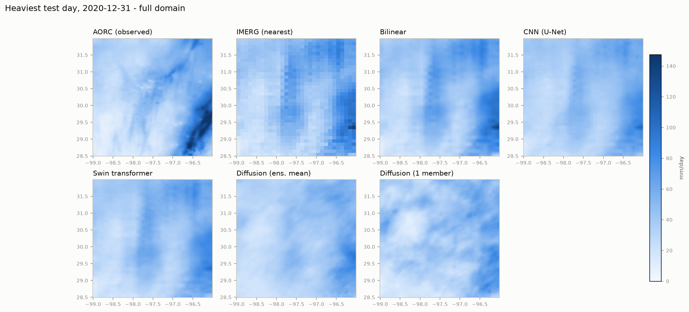
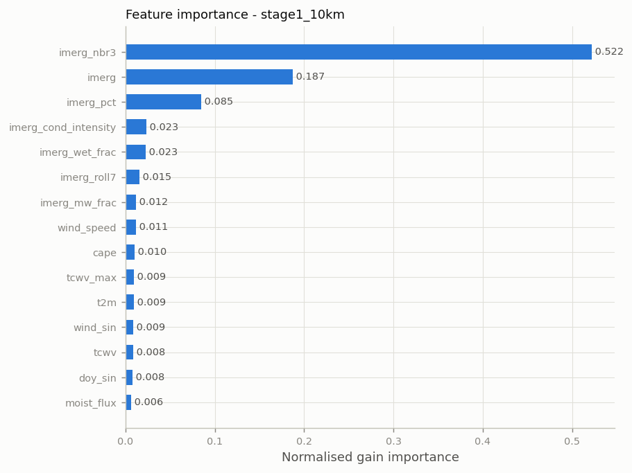
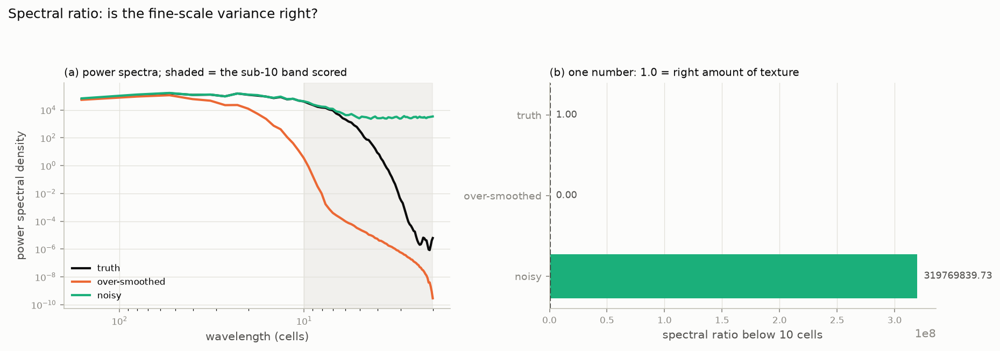
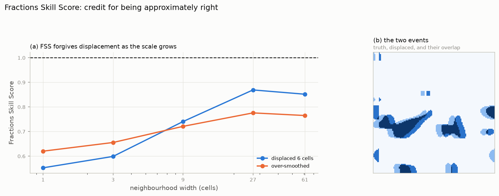
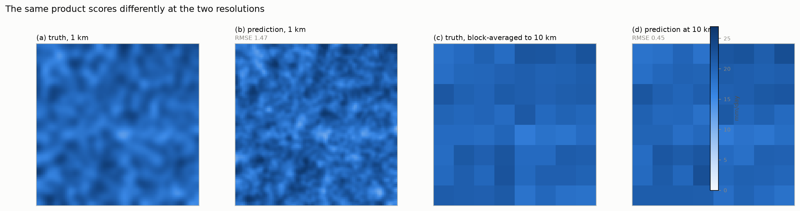
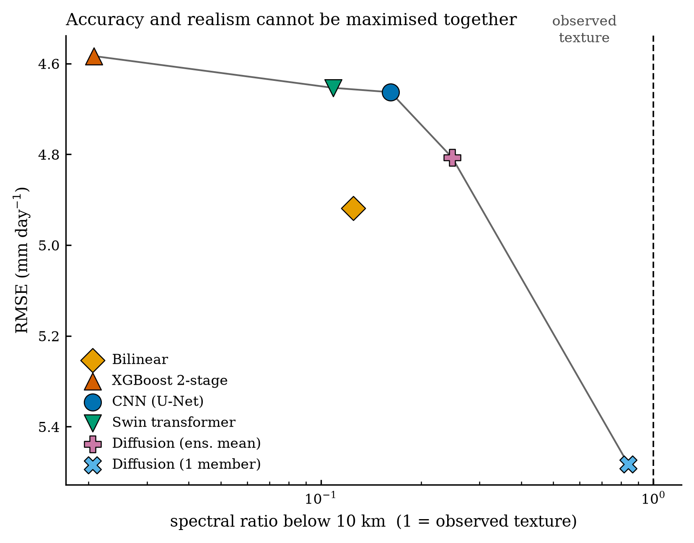
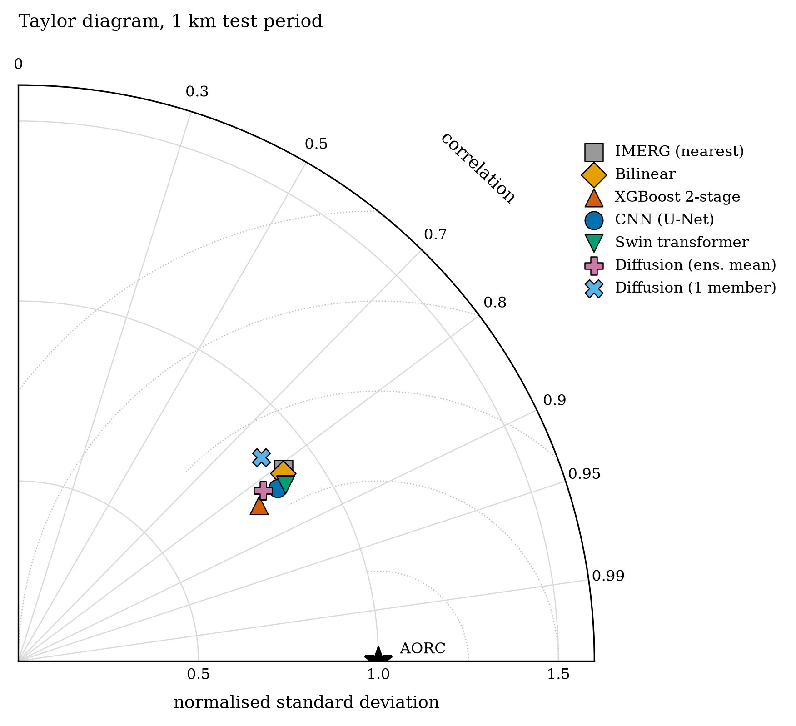
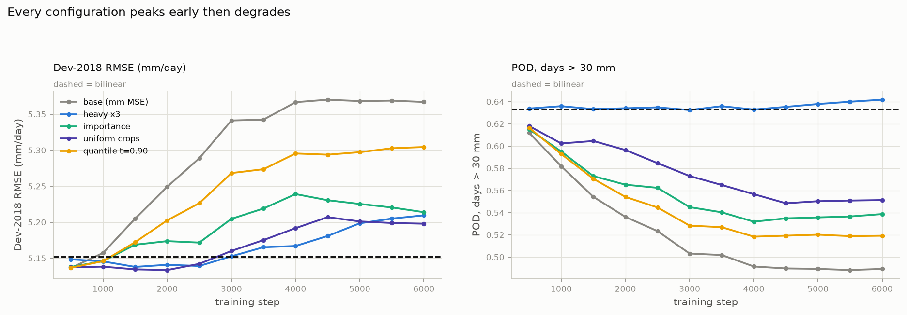

# Downscaling satellite precipitation from 10 km to 1 km

A study of whether machine learning can add genuine information below the
satellite's native resolution — and how to tell whether it has.

> Figures referenced here live in [`results/figures/`](../results/figures/).
> A slide-by-slide mapping is in [§8](#8-slide-deck-mapping).

---

## 1. The problem

NASA's IMERG gives global precipitation at 0.1° (~10 km). Flood modelling, small
catchments and urban hydrology need ~1 km. The gap is not a formatting problem:

**One 10 km cell contains a 12 × 12 block of 144 one-kilometre cells.** The model
must produce 143 numbers per cell that the input does not determine, constrained
only by their average.


*One coarse cell (outlined) expands to 144 fine cells. Nothing in a 10 km
average says which square kilometre got the storm core.*

**Study domain**: Austin, Texas — `[-99.0, 28.5, -96.0, 32.0]`, ~300 × 390 km,
1,050 coarse cells → 151,200 fine cells.
**Period**: 2000-06-01 to 2020-12-31 (7,519 days).
**Reference**: AORC, a 1 km gridded analysis.

---

## 2. Data

| dataset | role | resolution | access |
|---|---|---|---|
| **IMERG** `GPM_3IMERGDF` V07 | predictor | 0.1°, daily | NASA GES DISC, OPeNDAP subsetting |
| **AORC** v1.1 | target / reference | 1/120°, hourly → daily | NOAA on AWS, anonymous |
| **ERA5** | predictor | 0.25° | ARCO-ERA5 on GCS, anonymous |
| **NLCD 2021** | predictor | 30 m → 1 km | USGS MRLC |
| **Copernicus GLO-90 DEM** | predictor | 90 m → 1 km | AWS, anonymous |
| **GHCN-Daily** | independent validation | point gauges | NOAA NCEI |

Two design decisions shaped everything downstream:

**The fine grid *is* AORC's native grid**, so the 1 km reference is never
interpolated. The 12 × 12 block sits 460 m off the IMERG cell centre — under 5 %
of a coarse cell, and preferable to resampling the target.

**Splits are temporal and identical across all model families**, so products can
be compared and combined without leakage:

```
train  2000-06-01 .. 2017-12-31   (6,423 days)
dev    2018                        (model selection)
test   2019-2020                   (731 days, scored once)
```

---

## 3. Methodology

Four model families, deliberately spanning very different inductive biases:

| model | what it is | parameters |
|---|---|---|
| **XGBoost, 2-stage** | stage 1 corrects IMERG at 10 km; stage 2 predicts the 1 km residual | ~220 trees, depth 4 |
| **CNN** | U-Net over the 1 km grid | 1.65 M |
| **Swin transformer** | SwinIR-style shifted-window attention | 7.9 M |
| **Diffusion** | conditional denoising diffusion over the residual from the CNN mean; produces an **ensemble** | 12.4 M |

Every model outputs `bilinear(coarse) + correction` with a zero-initialised
head, so **an untrained model is exactly the bilinear baseline**. Any gain is
measured against interpolation by construction.



*The heaviest test day. Every product tracks the large-scale pattern; the
differences are at fine scales, which is the whole question.*

---

## 4. Feature store

**31 conditioning channels at 10 km**, in four groups:

| group | features | why |
|---|---|---|
| **IMERG dynamic** | `imerg`, `imerg_roll7`, `imerg_pct`, `imerg_nbr3` | the retrieval itself, its recent history, its rank against local climatology, its neighbourhood |
| **Sub-daily structure** | `imerg_wet_frac`, **`imerg_cond_intensity`**, `imerg_mw_frac`, `imerg_prob_liquid` | derived from the daily granule's half-hour counters: was this 30 mm one violent hour or twelve gentle ones? |
| **ERA5 atmosphere** | `cape`, `cape_max`, `tcwv`, `tcwv_max`, `t2m`, `wind_speed`, `wind_sin`, `wind_cos`, `moist_flux` | the storm environment IMERG cannot see |
| **Static surface** | `dem_mean`, `dem_std`, `slope_mean`, `imperv_mean`, 8 × `lc_frac_*` | terrain and land cover |
| **Temporal** | `doy_sin`, `doy_cos` | seasonality |

Plus **23 features at 1 km** for the residual stage: upsampled coarse fields,
1 km terrain and land cover, and interactions (`dem_x_slope`, `dem_anom`).



*IMERG and its neighbourhood dominate. `imerg_cond_intensity` ranks 4th and
`imerg_wet_frac` 5th — above every ERA5 field.*

Two features earn specific mention:

* **`imerg_pct`** converts "12 mm" into "a 97th-percentile day *here*", letting
  one model span a wet east and a dry west.
* **`imerg_cond_intensity`** = daily total ÷ (raining half-hours × 0.5 h). It
  separates convective from stratiform days — the single best discriminator of
  sub-grid structure, and it came free from granules already downloaded.

### 4.1 Sub-daily structure — the highest-value feature addition

Three slides' worth of the single most efficient thing we added.

---

**Slide A — A daily total hides how the rain fell**


Both days deliver **38 mm** and a daily field cannot tell them apart:

| | wet half-hours | intensity while raining |
|---|---|---|
| Convective | 6 / 48 | **12.5 mm/h** |
| Stratiform | 30 / 48 | **2.5 mm/h** |

The convective day concentrates its rain into a few square kilometres; the
stratiform day spreads it evenly. That is exactly the sub-grid information a
downscaler needs, and daily accumulation destroys it.

---

**Slide B — The structure was already in the files we had**

The obvious route was the half-hourly product: 48 granules × 7,519 days =
**360,912 granules, ~33 hours of downloading**. Not viable.

But the *daily* granule carries its own half-hour counters. Four derived
features follow:

| feature | definition | captures |
|---|---|---|
| **`imerg_cond_intensity`** | total ÷ (wet half-hours × 0.5 h) | mm/h *while raining* — convective vs stratiform |
| `imerg_wet_frac` | wet ÷ valid half-hours | how much of the day was wet |
| `imerg_mw_frac` | microwave ÷ merged estimate | real overpass vs IR morphing — retrieval trust |
| `imerg_prob_liquid` | phase probability | rain vs frozen |

**Cost: 62 KB/day instead of 33 KB — the same requests, one longer query
string.** `randomError` was excluded: labelled mm/day but with a median near
5,000 mm/day, it is not physical and therefore not usable as an uncertainty.

---

**Slide C — Every model family improved**


| model | 27 features | 31 features |
|---|---|---|
| XGBoost | 4.655 | **4.583** |
| CNN | 4.694 | 4.663 |
| Swin | 4.729 | **4.653** |
| Diffusion (ens. mean) | 4.840 | 4.807 |

Margin over bilinear went **5.4 % → 6.8 %**. `imerg_cond_intensity` ranks 4th
of 31 and `imerg_wet_frac` 5th, above every ERA5 field; `imerg_prob_liquid`
ranks last, because Texas rainfall is almost always liquid.

It also resolved something two earlier attempts had not. The diffusion ensemble
was under-dispersed at ~0.57 of observed spread; changing the parameterisation
(ε → x₀ → v) and adding min-SNR loss weighting both failed to move it. Adding
these features moved it to **0.81** — learning a conditional *distribution*
needs more information than learning a conditional mean.

*Caveat: per-model gains are 0.7–1.6 %, from single training runs with no seed
repeats, so differences under ~0.5 % are within run-to-run noise. The XGBoost
and Swin gains are the defensible ones.*

---

---

## 5. Metrics

Scores fall into three families, because no single number is sufficient.

### Accuracy — is the amount right?

RMSE, MAE, bias, Pearson **r**, **NSE** (Nash-Sutcliffe Efficiency), **KGE**
(Kling-Gupta Efficiency). KGE matters specially: it decomposes into correlation,
variability ratio and bias ratio, so **it penalises over-smoothing where RMSE
rewards it**.

### Realism — does the field look like rain?

**Spectral ratio below 10 km** (predicted ÷ observed variance at short
wavelengths; 1.0 = realistic), **FSS** (Fractions Skill Score), wet-area ratio,
blockiness.



*The diagnostic is two-sided: smoothing loses power, noise adds too much. Only
values near 1.0 are right.*



*FSS gives credit for rain placed approximately correctly. A displaced field
recovers as the neighbourhood widens; an over-smoothed one never does.*

### Extremes and uncertainty

**POD** (Probability of Detection), **CSI** (Critical Success Index), **CRPS**
(Continuous Ranked Probability Score — reduces exactly to MAE for a
deterministic field, so ensembles and single fields sit on one scale).

### Two evaluation levels, never comparable



*The same prediction scores far better at 10 km than at 1 km, purely because
averaging 144 cells cancels independent error. Compare only within a level.*

Full definitions and formulas: [METRICS.md](METRICS.md).

---

## 6. What we prioritised, and why not RMSE

**RMSE alone is actively misleading on this task.** The field that minimises
squared error is the conditional mean — which, for convective rainfall, is a
blur. A displaced storm cell is punished twice: a miss where the rain was, a
false alarm where it was not.


*Both candidates carry the same total water. The smooth field scores better on
RMSE while keeping only 20 % of the true peak; the correctly-sharp field,
displaced 8 km, scores 1.7× worse.*

So we judged products on a **Pareto front**, not a leaderboard:



*RMSE against retained fine-scale variance. Products with the best RMSE retain
2–20 % of observed texture; the only product with realistic texture has the
worst RMSE.*

**The priority order we adopted:**

1. **Beat bilinear interpolation** — non-negotiable; an untrained model already ties it.
2. **Accuracy *and* variability together** (RMSE with KGE), never RMSE alone.
3. **Heavy-event detection** (POD, CSI) — learned models routinely lose here, so it is reported always.
4. **Realism** (spectral ratio, FSS) — a product that scores well but cannot occur in nature is not useful for hydrology.
5. **Calibrated uncertainty** (CRPS, ensemble spread) where a model produces one.

---

## 7. Results

Test period 2019–2020, 731 days, 1 km, against AORC.

| product | RMSE | MAE | bias | NSE | KGE | CRPS | POD>30 | CSI>30 | spectral ratio |
|---|---|---|---|---|---|---|---|---|---|
| IMERG nearest | 4.994 | 1.529 | −0.080 | 0.647 | 0.787 | 1.529 | 0.600 | 0.440 | 32.7 |
| Bilinear | 4.919 | 1.506 | −0.082 | 0.657 | 0.787 | 1.506 | 0.601 | 0.445 | 0.125 |
| **XGBoost** | **4.583** | **1.467** | −0.046 | **0.702** | 0.739 | 1.467 | 0.548 | 0.458 | 0.021 |
| CNN | 4.663 | 1.511 | 0.044 | 0.692 | 0.784 | 1.511 | 0.614 | 0.468 | 0.162 |
| **Swin** | 4.653 | 1.520 | 0.145 | 0.693 | **0.790** | 1.520 | **0.633** | **0.469** | 0.109 |
| Diffusion (mean) | 4.807 | 1.493 | −0.113 | 0.673 | 0.746 | **1.050** | 0.511 | 0.413 | 0.248 |
| Diffusion (member) | 5.483 | 1.668 | −0.132 | 0.574 | 0.731 | 1.668 | 0.467 | 0.354 | **0.840** |


*RMSE against retained fine-scale variance, both coarse inputs. Log vertical
axis; the dashed line is correct texture. Products on the left are accurate,
products near the line are realistic.*

**Three products win different things:**

* **XGBoost** — accuracy: best RMSE (6.8 % below bilinear), MAE, bias, NSE.
* **Swin** — extremes and variability: best POD, CSI, and the only KGE above bilinear's.
* **Diffusion** — probabilistic and realism: CRPS 28 % better than any deterministic product; its single member retains 84 % of observed texture.



*Correlation, normalised variability and centred RMS in one view. Every learned
product sits inside the unit radius — all are smoother than the observations.*


*Deterministic products lose one to two orders of magnitude of variance below
~30 km. The diffusion member tracks the observed spectrum — and so, from a
deterministic model, does the spectral-penalty CNN (dashed; see §7.1).*

### 7.1 Training the spectrum, not just reporting it

The table above has an obvious shape: the best-RMSE product keeps 2 % of real
texture, and the only realistic product has the worst RMSE. That looked like a
property of the problem. It is partly a property of the **objective** — every
loss in the project was a per-cell loss, and a per-cell loss is minimised by the
conditional mean, which is smooth. The spectral ratio was measured and never
optimised.

Adding a differentiable penalty on the log power spectrum below 10 km
(`--spectral-weight 0.01`) changes that, on both coarse inputs:

| | RMSE | spectral ratio | POD > 30 mm |
|---|---|---|---|
| IMERG 10 km, matched control | 4.654 | 0.303 | 0.540 |
| **IMERG 10 km, + spectral** | **4.635** | **1.260** | 0.533 |
| POWER 50 km, matched control | **5.782** | 0.167 | 0.391 |
| **POWER 50 km, + spectral** | 5.821 | **1.281** | **0.414** |

On the 10 km input, 4.2× the texture with RMSE unchanged inside seed noise — a
three-seed paired test puts the difference at **+0.004 ± 0.021 mm day⁻¹**, and
two of three seeds came out *better* with the penalty. On the 50 km input, 7.7×
the texture for 0.68 % of RMSE, and heavy-event detection, KGE and FSS all
improve as well.


*(a) The weight sweep. The knee is at w = 0.01 — larger weights pay more RMSE
for no further texture. (b) Texture during training for the matched pair.*

Is the added variance real structure, or noise of about the right size? The
spectral ratio cannot tell — it is an amplitude diagnostic. FSS can, and for the
1 mm threshold it improves at **every** neighbourhood width including a single
cell, which noise would have degraded. Two honest caveats: it overshoots (≈1.3
against a target of 1.0), and the checkpoint is still chosen on RMSE alone, so
on POWER — where texture decays as training proceeds — the result depends on the
RMSE optimum falling early.


*A 70 km window on a convective day. AORC resolves a sharp rain band; the
deterministic products smooth it away; only the diffusion member carries
comparable structure.*

### Independent validation against rain gauges

616 GHCN-Daily stations, same test period, with per-station observation-time
alignment:

| product | RMSE | MAE | bias |
|---|---|---|---|
| AORC (the reference itself) | 6.314 | 1.831 | +0.017 |
| **XGBoost** | **6.754** | **2.235** | +0.004 |
| CNN | 6.993 | 2.323 | +0.091 |
| Swin | 7.032 | 2.342 | +0.175 |
| Bilinear | 7.220 | 2.317 | −0.021 |

**The ranking survives against instruments** — XGBoost is 6.5 % better than
bilinear here versus 6.8 % against AORC, so the gain is real rather than an
artefact of fitting the reference. All values are ~40 % higher than against
AORC because a gauge is a point and a cell is 0.86 km²; only the *ordering* is
interpretable, and AORC's lead is expected since it assimilates gauge data.

---

## 8. Inferences

**1. Gains came from information, never architecture.**


A 1.65 M CNN, an 11.7 M CNN and a 7.9 M transformer converge to the same skill.
What moved the numbers was **ERA5 predictors (−2.2 %)**, a **4.6× longer record
(−2.0 %)** and **sub-daily structure (−1.5 %)**.

**2. The effective sample size is weather days, not grid cells.**



151,200 cells per day, but cells within a day are strongly correlated — the
independent unit is the ~6,400 training days. Models overfit within a few
thousand steps.

**3. Sub-grid placement is not recoverable here.** The 1 km residual stage was
rejected automatically on every configuration tried — with 18.5 years of data
and 31 features (hold-out 5.167 vs bilinear 5.176). A 10 km average, terrain and
land cover do not say which square kilometre got the storm.

**4. Accuracy and realism are different estimators — but less irreconcilable
than they first appeared.** The conditional mean minimises squared error; a
sample from the conditional distribution looks like rain; an upper quantile
detects extremes. Asking one raster to be all three is a decision-theory error,
and that is the argument for the diffusion model, which produces the whole
distribution.

That argument held while the spectrum was only ever *measured*. Once it enters
the objective (§7.1), a deterministic CNN reaches realistic texture at better
RMSE than bilinear, where previously that required a diffusion model costing
+11 % RMSE. What survives is narrower: a generative model is still the right
answer when a calibrated *distribution* is needed — CRPS is ~25 % better than
any deterministic product on both inputs — but realistic texture alone no longer
requires one.

**5. Plan targets were missed, and the reason is the domain.** 6.8 % RMSE
reduction against a 20 % target; POD 0.633 against 0.80. Austin is flat — 8 of
151,200 cells exceed 5° slope — and IMERG is already nearly unbiased here. Those
targets assume orographic structure this domain does not have.

---

## 9. Slide deck mapping

| slide | content | figure |
|---|---|---|
| 1 | Title — 10 km → 1 km precipitation downscaling | — |
| 2 | The problem: 144 unknowns per cell | `explainer/E1_the_problem.png` |
| 3 | Data sources and study domain | table from §2 |
| 4 | Methodology: four model families | table from §3 |
| 5 | What the products look like | `20_fields_heavy_day_domain.png` |
| 6 | Feature store: 31 channels, four groups | table from §4 |
| 7 | Which features matter | `17_feature_importance_stage1.png` |
| **8** | **Sub-daily: a daily total hides how the rain fell** | `27_subdaily_concept.png` |
| **9** | **Sub-daily: the structure was already in our files** | table from §4.1 |
| **10** | **Sub-daily: every model family improved** | `28_subdaily_gain.png` |
| 11 | Why RMSE alone misleads — the double penalty | `explainer/E2_double_penalty.png` |
| 12 | Measuring realism: spectral ratio | `explainer/E4_spectral_ratio.png` |
| 13 | Measuring placement: FSS | `explainer/E3_fss.png` |
| 14 | Two evaluation levels | `explainer/E5_two_levels.png` |
| 15 | Metric priorities | list from §6 |
| 16 | **Headline results** | `paper/P1_headline_scores.png` |
| 17 | **The central trade-off** | `paper/P2_accuracy_realism_tradeoff.png` |
| 18 | Taylor diagram | `paper/P3_taylor_diagram.png` |
| 19 | Power spectra | `paper/P4_power_spectra.png` |
| 20 | **Texture, zoomed — the money shot** | `21_fields_zoom_texture.png` |
| 21 | Independent gauge validation | table from §7 |
| 22 | Architecture doesn't matter; information does | `07_capacity_architecture_ablation.png` |
| 23 | Effective sample size | `09_overfitting_curves.png` |
| 24 | Conclusions and limitations | list from §8 |

**If you only have five slides**: 2 (the problem), 11 (double penalty), 16
(headline), 17 (trade-off), 20 (texture).

Supporting figures not in the core deck — per-intensity skill
(`04_skill_by_intensity.png`), detection by threshold
(`05_detection_by_threshold.png`), FSS by scale
(`paper/P5_fractions_skill_score.png`), error maps
(`22_field_errors_heavy_day.png`), city time series (`16_city_timeseries.png`),
ensemble vs member (`25_diffusion_ensemble_vs_member.png`).
