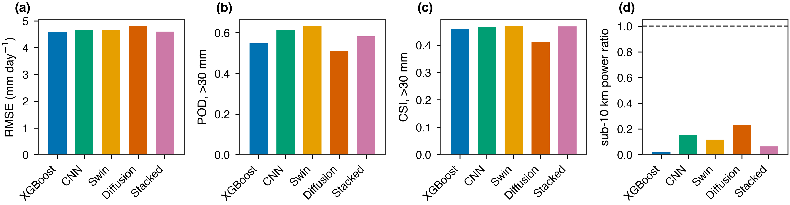
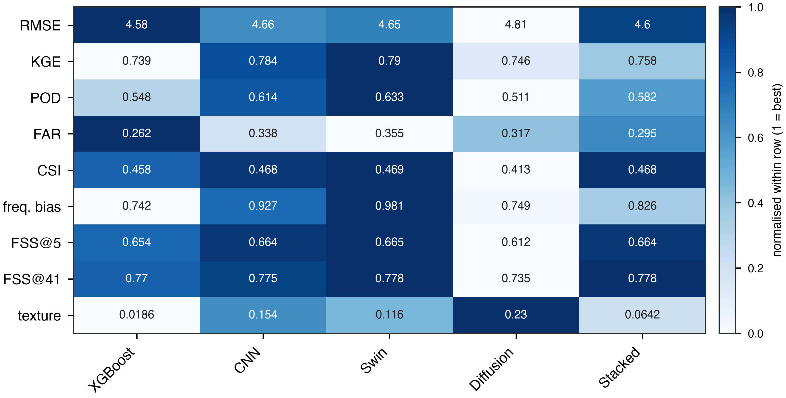
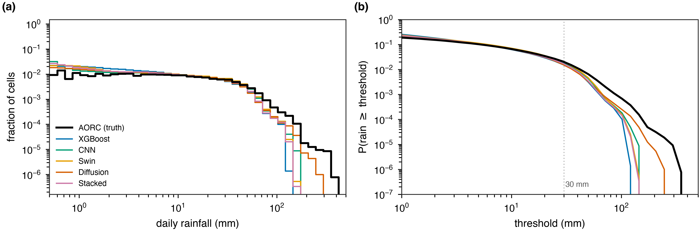
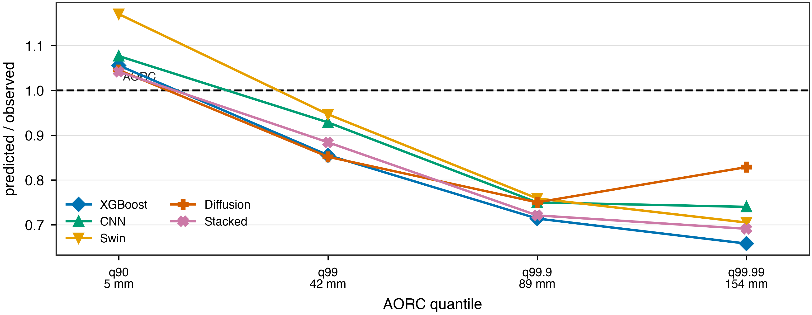
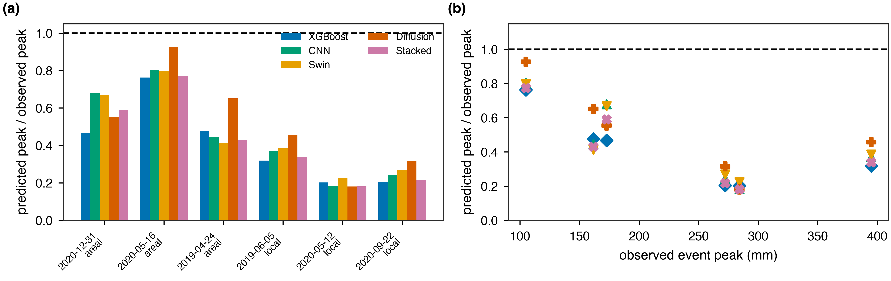
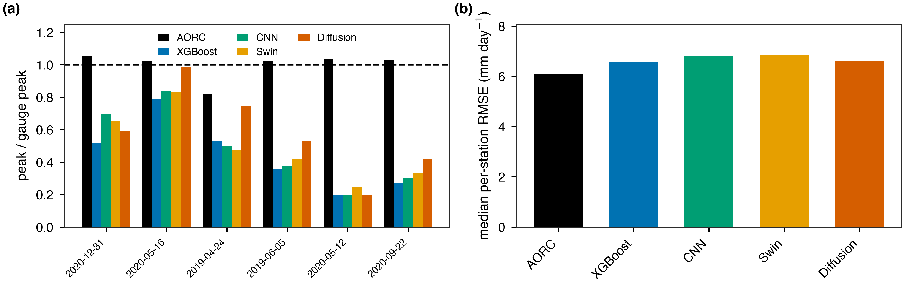
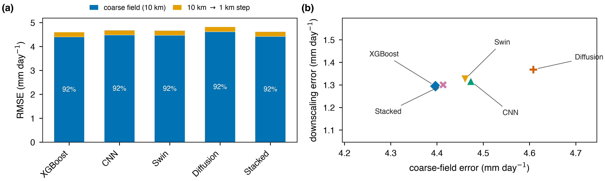
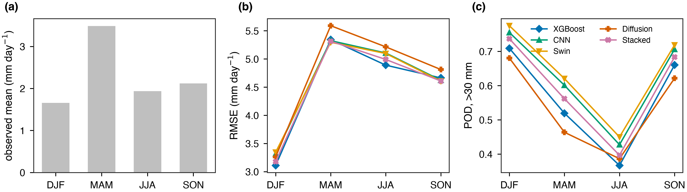
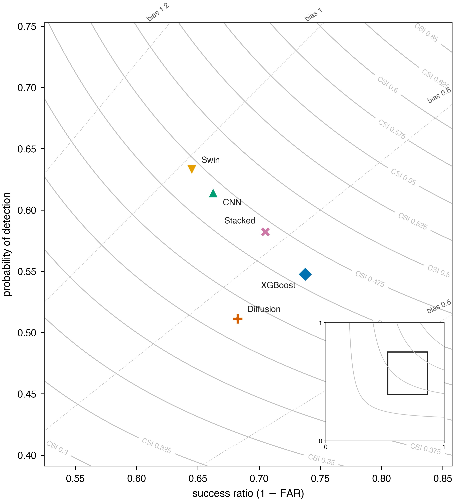

# Making satellite rain maps sharper: what we did, what we found

A plain-language summary of the whole project. Numbers are from the 2019–2020
test period, which no model ever trained on.

Figures live in `results/figures/review/` (Austin) and `results/figures/review_co/`
(Colorado Front Range).

---

## 1. The problem in one paragraph

Satellites measure rainfall over squares about **10 km** across. A lot of decisions —
which street floods, which hillside slides — need something closer to **1 km**. So we
take the coarse satellite map and try to produce a fine one. To check whether it
worked, we compare against **AORC**, a 1 km national rainfall analysis we treat as the
truth.

Each 10 km square contains 144 of the 1 km squares we are trying to fill in. The
satellite gives us one number for all 144. Something has to supply the rest.

## 2. How we set it up

**Two places, built to be the same size** so that any difference between them is about
the weather and not the experiment:

| | Austin, Texas | Colorado Front Range |
|---|---|---|
| terrain | flat | mountainous |
| cells steeper than 5° | 0.000 | 0.255 |
| rain type | summer thunderstorms | air forced up over mountains |

**Time is split so nothing leaks.** We train on 2000–2017, tune on 2018, and report
everything on **2019–2020**, which the models never see during training.

**Five methods, each testing a different idea** about where the missing detail comes
from:

1. **Bilinear interpolation** — just smooth the coarse map out. This is the thing to
   beat. Every model is built as *bilinear + a correction*, so an untrained model is
   exactly the bilinear baseline and no improvement can be an accident of tuning.
2. **XGBoost** — thousands of small yes/no rules. Tests the idea that the fix is a
   local correction you can learn cell by cell.
3. **CNN (U-Net)** — looks at neighbourhoods, not single cells. Tests whether the
   detail is a *pattern* problem.
4. **Swin transformer** — can see much further across the map. Tests whether you need
   to know what the air was doing 50 km upwind.
5. **Diffusion** — instead of predicting one answer, it samples from the range of
   plausible answers. Tests whether the real problem is that averaging produces
   something too smooth to be real rain.

## 3. Headline comparison

*Dots are the scores; the horizontal bars are 95 % confidence intervals.*

| | error (mm/day) | heavy rain found | texture |
|---|---|---|---|
| XGBoost | **4.58** | 0.55 | 0.02 |
| Stacked | 4.60 | 0.58 | 0.06 |
| Swin | 4.65 | **0.63** | 0.12 |
| CNN | 4.66 | 0.61 | 0.15 |
| Diffusion | 4.81 | 0.51 | **0.23** |

**The most important thing in this figure is the overlap.** The confidence bars for
error, detection and skill overlap almost completely. We can say the models are
*similar*; we cannot honestly rank them. "Texture" is how much fine-scale detail the
map has compared with real rain — **1.0 would be correct, and everything here is far
below it.** Every product is smoother than real rainfall.

No single method wins everywhere. XGBoost has the lowest error and fewest false
alarms, Swin finds the most heavy rain, diffusion has the most realistic texture.
**They are different tools, not better and worse versions of one tool.**

## 4. What the models get wrong

### They rain too often, and not hard enough

Real rain in Austin falls on **28 %** of cells. Our products say **46–60 %** — they
sprinkle a little rain nearly everywhere. At the same time they will not produce the
very heavy values:

At moderate intensities they are about right. At the heaviest 1-in-10,000 cell they
reach only **66–83 %** of what actually fell. Diffusion is the best of them at 83 %,
which is exactly what it was designed for.

The reason is simple. Training rewards being close *on average*, and the safest way to
be close on average is to hedge — put a little rain everywhere and never commit to a
big number. Our error measure actively encourages this.

### The bigger the storm, the worse they do

We picked six real storms from 2019–2020 and scored each one on its own.

| observed peak | how much of it the best model captured |
|---|---|
| 105 mm | about 80 % |
| 160–175 mm | about 65 % |
| 272–284 mm | **20–32 %** |
| 395 mm | about 43 % |

On 12 May 2020 the observed peak was **284 mm**. The best model produced **64 mm**.

### This is not an artefact of our reference

Someone could object that AORC is also imperfect, and we are only measuring agreement
with it. So we checked against **687 independent rain gauges**:

AORC matches the gauge peak within a few per cent on five of six storms (black bars,
near 1.0). The models sit at **0.19–0.53**. On 5 June 2019 the gauges recorded
**305 mm**, AORC **311 mm**, and the best model **161 mm**.

**The shortfall is real.** The models miss extremes, not just disagree with AORC.

## 5. The experiment that changed the project

We asked: *how much of the remaining error is the satellite being wrong, and how much
is the 10 km → 1 km step being genuinely hard?*

To separate them we built a **perfect input**. We took the truth, averaged it down to
10 km, and fed that in instead of the satellite. Everything else stayed the same. Any
error left is only what averaging destroyed.

| | with the real satellite | with a perfect 10 km input |
|---|---|---|
| **Austin** | 4.58 | **0.72** |
| **Colorado** | 2.83 | **0.49** |

Written as a budget: **about 92 % of the error is already in the coarse map before
downscaling starts.** The 10 km → 1 km step contributes a few per cent.

Detection changes just as dramatically. In Colorado the models find **13 %** of heavy
rain cells with the real satellite, and **92 %** with a perfect input. Every
loss-function idea we tried moved that number by about 3 points.

**Two things follow, and they redirected the work:**

1. **A better downscaler cannot help much.** A *perfect* one buys about 1 %.
2. **Accuracy matters more than resolution.** A perfect **0.5°** input (3.00) still
   beats our best real **0.1°** product (4.58). A five-fold coarser grid costs less
   than the satellite's error does.

So we stopped trying to improve the downscaling step and started trying to improve the
10 km map.

## 6. What actually helped

### Giving the model reanalysis rainfall

ERA5 is a weather reanalysis — a physics model fitted to past observations. We had
been feeding the model ERA5's humidity, temperature, wind and instability, but **not
ERA5's own estimate of rainfall**. Adding it:

| | 10 km error before | after | gain |
|---|---|---|---|
| Austin | 4.49 | 4.34 | **0.15** |
| Colorado | 2.73 | 2.46 | **0.27** |

It helps roughly **twice as much in the mountains**, which is what we expected:
satellites are weakest on cool-season mountain rain and snow, and a physics model is
comparatively good there.

Why it works is worth stating. ERA5 on its own is the *worse* product — it agrees with
the truth less well than the satellite does. But its errors are **different** errors,
and its long-run average is almost exactly right where the satellite runs dry. The
model is not replacing the satellite; it is using a second, independent opinion.

### Training the model to produce realistic texture

We added a penalty for being too smooth, plus extra weight on heavy-rain cells. Over
five random starts in Austin:

- detection of heavy rain: **+0.065** (a large, consistent effect)
- error: **−0.004** (no measurable cost)
- texture: roughly **3× more** fine-scale detail

On the 13 March 2019 Front Range blizzard it captured **69 %** of the peak against
XGBoost's 48 % — the clearest case of this helping on a real storm.

**One honest caveat:** on a *perfect* input this penalty makes things slightly worse.
It is compensating for a bad input rather than adding real skill.

## 7. Things we tried that did not work

Recording these matters as much as the successes.

| idea | result | why |
|---|---|---|
| Bigger/fancier networks | no real gain | capacity was never the limit |
| More training years | ~0.07 mm per doubling | we would need ~50 doublings to close the gap |
| A map of each cell's historical bias | **worse** (4.39 → 4.46) | the bias is not stable — the 2015–17 map correlates **−0.11** with the 2019–20 one |
| Neighbourhood ("multiscale") loss | nothing | tolerates displacement, does not create structure |
| Picking checkpoints on texture | nothing over 5 seeds | looked good at one seed, was luck |
| IMERG's previous/next day | nothing | both products already use the same day boundary |
| A smarter spectral loss (AMSE) | slightly worse | — |

**The pattern:** almost nothing on the modelling side moved the needle. The one thing
that did was **new information**.

## 8. Where it works and where it does not

**Useful for:** total rainfall over a catchment or a season. All products clearly beat
plain interpolation, and the mountain domain benefits most.

**Not yet usable for:** the single heaviest cell in a severe storm — the design-storm
case. Models recover a fifth to a third of the peak, and the gauges confirm it.

**A caution about mountain gauges.** In Colorado the gauge comparison inverts: AORC
scores *worse* against gauges (3.13) than the models do (2.90–2.95). We do not think
the models are better. Mountain gauges sit in valleys while the heaviest rain falls on
slopes, so a smooth map matches a sparse valley sample better than a sharp one does.
**77 %** of Colorado gauges correlate below 0.7 with AORC at their own location,
against 62 % in Austin. Gauge checks are weaker evidence in mountains.

## 9. What we would do next

1. **Feed the 10 km stage more independent information.** This is the only thing that
   has worked. Other satellite products with different error patterns are the obvious
   next addition.
2. **Use the satellite's own quality flags.** IMERG records how much of each estimate
   came from its good sensor versus a gap-filling one. That is the satellite telling us
   where it was guessing, and nothing else in our inputs carries it.
3. **Report a distribution, not a single number.** The products hedge because a single
   number is scored on being close on average. A model that outputs a *range* could
   give a usable heavy-rain warning without being punished for committing.
4. **Be careful with gauges in complex terrain**, for the reason in §8.

## 10. Does the downscaling actually work?

This deserves a direct answer, because "92 % of the error is already in the input"
and "the downscaling works" cannot both be waved at the same time.

To separate them we scored plain interpolation with the same split:

| | error at 1 km | error at 10 km | the 10 km → 1 km part |
|---|---|---|---|
| raw satellite, blocky | 4.994 | 4.812 | 1.333 |
| bilinear interpolation | 4.919 | 4.732 | 1.342 |
| **XGBoost** | **4.583** | **4.397** | **1.295** |

Now split XGBoost's improvement over bilinear into its two parts. Errors add as
squares, so the shares are taken that way:

| where the improvement comes from | share |
|---|---|
| correcting the 10 km map | **96 %** |
| the 10 km → 1 km step itself | **4 %** |

So three statements, and only the first two are ours to make:

**The product beats interpolation.** 4.583 against 4.919, a 6.8 % reduction on years
the model never saw. That is real.

**Almost all of it is correcting the coarse map.** What we have built is a good 10 km
bias-corrector that then interpolates. That is a useful thing and it is not what
"downscaling" usually means.

**The sharpening step itself adds very little.** It beats bilinear by **0.047 mm** —
0.9 % of the total error. A perfect sharpener would remove the whole 1.342 mm; we have
captured **3.5 %** of that.

This also explains something that looked strange earlier. Four very different
architectures had 10 km → 1 km errors spanning 0.067 mm while their 10 km errors
spanned 0.195. **They differ as bias correctors, not as downscalers.** And it matches
the storms: a model that is essentially smoothing a corrected coarse field is exactly
the kind of model that recovers a fifth of a 284 mm peak.

## 11. The honest summary

We set out to add 1 km detail to a 10 km satellite map. What we have is a system that
**corrects the 10 km map well and adds little genuine 1 km detail** — and we can now
say that with a number rather than a suspicion.

That is worth knowing rather than disappointing, for three reasons.

The *product* is better than the alternatives, by a margin that holds up on unseen
years and against independent gauges. Someone who needs catchment totals should use it.

The limit is now located. 92 % of the remaining error was in the coarse map before we
started, and the sharpening step has only 1.34 mm available to it in the first place.
No amount of architecture work reaches past that.

And the one intervention that did move the number — giving the 10 km stage ERA5's own
rainfall, worth 0.15 mm in Austin and 0.27 mm in the mountains — worked on the 96 %
side, not the 4 % side. That is the direction with room in it.
