<!-- Render with Marp (`marp docs/SLIDES.md`), Pandoc, or read as a document.
     Slides are separated by `---`. Image paths are relative to docs/. -->

# Orographic forcing, not model capacity, sets the ceiling

### Downscaling satellite precipitation from 10 km to 1 km

Two domains · three coarse inputs · four model families · 18.5 years
Evaluated on 731 unseen days against a 1 km reference

---

## The problem

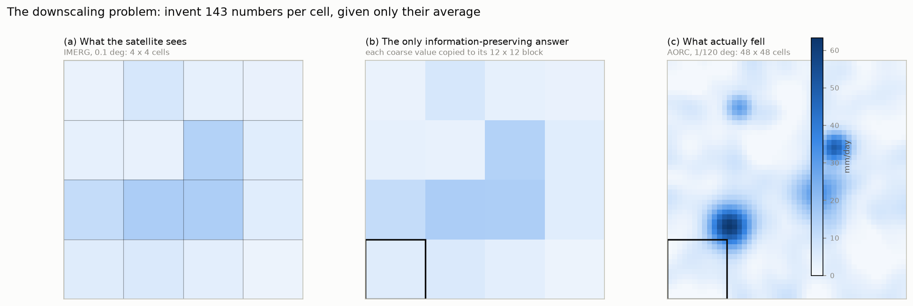

One IMERG cell covers a **12 × 12 block of 144 one-kilometre cells**.

A downscaler must produce **143 numbers per cell that the input does not
determine**, constrained only by their mean.

This is not interpolation with a better interpolator waiting to be found.

---

## Two regimes, one of which is learnable

**Orographically forced** — terrain fixes where rain falls. Air is lifted over a
slope, cools, condenses; windward wet, lee dry, every time.
→ the mapping from (coarse total, elevation, slope, wind) to the fine field is
nearly deterministic. *This is where the literature's 15–25 % comes from.*

**Convectively forced** — the pattern is set by where individual storm cells
happen to organise. Chaotic at the scales that matter, and absent from every
coarse predictor.

Most studies report one domain, which **conflates method with regime**.
We hold everything constant except the regime.

---

## What we contribute

1. A **controlled two-domain comparison** — identical size, period, splits and
   predictors; only terrain differs
2. A **seasonal decomposition** that identifies the mechanism
3. A **free, high-value predictor source** hidden in the daily granule
4. **Seed repeats** that bound the noise floor and retire one published comparison
5. A systematic **negative result on architecture**
6. An **evaluation protocol** that exposes the accuracy–realism trade-off
7. A **spectral training objective** that partly dissolves that trade-off

---

## Data

| dataset | role | resolution |
|---|---|---|
| **IMERG** V07 Final | predictor | 0.1°, daily |
| **AORC** v1.1 | target and reference | 1/120°, hourly → daily |
| **ERA5** | predictor | 0.25°, hourly → daily |
| **NLCD 2021** | predictor | 30 m → 1 km |
| **Copernicus GLO-90 DEM** | predictor | 90 m → 1 km |
| **GHCN-Daily** | independent validation | point gauges |
| **NASA POWER** (MERRA-2) | alternative input | 0.5° × 0.625° |

`randomError` from IMERG was excluded — labelled mm day⁻¹ but with a median near
5,000 mm day⁻¹, so unusable as an uncertainty estimate.

---

## Grid construction

- Coarse grid = IMERG's native 0.1°
- Fine grid = **AORC's native 1/120°**, so the reference is *never interpolated*
- Refinement factor 12 → 144 fine cells per coarse cell

Cost of that choice: the 12 × 12 block centre sits 460 m from the IMERG cell
centre — under 5 % of a coarse cell, and preferable to resampling the target.

**Two evaluation levels are never compared.** The same prediction scores far
better at 10 km than at 1 km purely because averaging 144 cells cancels
independent error. All headline numbers are at 1 km.

---

## Two domains, built to be identical

| | **Austin, TX** | **Colorado Front Range** |
|---|---|---|
| coarse / fine cells | 1,050 / 151,200 | 1,050 / 151,200 |
| elevation | 100–668 m | **1,221–4,245 m** |
| **cells above 5° slope** | **0.000** | **0.255** |
| cells ≥ 30 mm (test) | 2.02 % | 0.30 % |
| raw IMERG correlation | 0.821 | 0.573 |

Same size, same period, same splits, same 31 predictors.
**Only the terrain regime differs.**

---

## Splits

```
train  2000-06-01 .. 2017-12-31    6,423 days
dev    2018-01-01 .. 2018-12-31      365 days   selection, stacking weights
test   2019-01-01 .. 2020-12-31      731 days   scored once
```

Temporal and identical across all model families.

This matters: an earlier configuration trained through 2018 made the stacking
weights degenerate — NNLS gave the tree 100 %. Caught by an explicit leakage
check that refuses to fit weights on a period any member saw in training.

---

## Feature engineering — 31 channels at 10 km

| group | features |
|---|---|
| IMERG dynamic | `imerg`, `roll7`, `pct`, `nbr3` |
| **Sub-daily structure** | `wet_frac`, `cond_intensity`, `mw_frac`, `prob_liquid` |
| ERA5 atmosphere | CAPE, TCWV, t2m, wind (speed/sin/cos), moisture flux |
| Static surface | DEM mean/std, slope, impervious, 8 × land-cover fractions |
| Temporal | `doy_sin`, `doy_cos` |

`imerg_pct` converts "12 mm" into "a 97th-percentile day **at this location**",
letting one model span a wetter east and a drier west without per-cell parameters.

---

## The free predictor: sub-daily structure

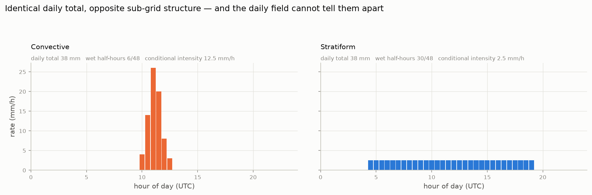

A daily total cannot distinguish 38 mm in six violent half-hours from 38 mm over
thirty gentle ones — yet these produce entirely different sub-grid fields.

The direct route is the half-hourly product: **360,912 granules, ~33 hours** of
transfer. The daily granule's own counters give the same information.

---

## …at essentially zero cost

| feature | definition | captures |
|---|---|---|
| `cond_intensity` | total ÷ wet half-hours | mm h⁻¹ *while raining* — convective vs stratiform |
| `wet_frac` | wet ÷ valid half-hours | what fraction of the day was wet |
| `mw_frac` | microwave ÷ merged | genuine overpass vs IR morphing |
| `prob_liquid` | phase probability | rain vs frozen |

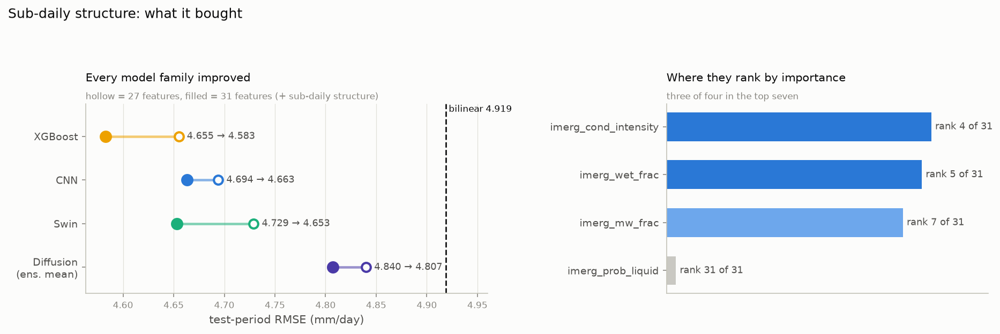

Cost: 62 KB/day instead of 33 KB, **same number of requests**.

---

## Architectures

| model | description | size |
|---|---|---|
| **XGBoost, 2-stage** | stage 1 corrects at 10 km; stage 2 optionally predicts the 1 km residual | depth 4, ≤2000 trees |
| **CNN** | U-Net over the 1 km grid | 1.65 M (11.7 M variant for ablation) |
| **Swin transformer** | SwinIR-style shifted-window attention | 7.9 M |
| **Residual diffusion** | conditional DDPM over the residual from a frozen mean, 40-step DDIM, 6 members | 12.4 M |

**All are parameterised as `bilinear(coarse) + correction`** with a
zero-initialised output head — so an untrained model *is exactly the bilinear
baseline*, and every reported gain is measured against interpolation by
construction.

---

## Evaluation — no single number is sufficient

**Accuracy** — RMSE, MAE, bias, *r*, NSE, **KGE**
KGE decomposes into correlation, variability and bias ratios, so unlike RMSE it
*penalises* over-smoothing.

**Realism** — spectral ratio below 10 km, FSS at several widths, wet-area ratio,
blockiness

**Extremes & uncertainty** — POD / FAR / CSI / frequency bias above 30 mm; CRPS,
which reduces exactly to MAE for a deterministic field and so places ensembles
and single rasters on one scale

---

## Why RMSE is actively misleading here

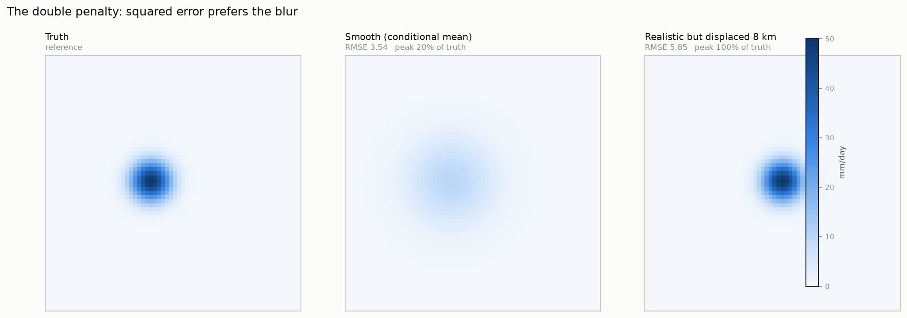

A correctly sharp field displaced by 8 km is penalised **twice** — a miss where
the rain was, a false alarm where it was not — and scores ~1.7× worse than a
smooth field carrying the same water at 20 % of the true peak.

The field minimising squared error is the **conditional mean**: a blur.

---

## Headline results — Austin, 731 test days

| product | RMSE | KGE | CRPS | POD>30 | spectral ratio |
|---|---|---|---|---|---|
| Bilinear | 4.919 | 0.787 | 1.506 | 0.601 | 0.125 |
| **XGBoost 2-stage** | **4.583** | 0.739 | 1.467 | 0.548 | 0.021 |
| CNN (U-Net) | 4.663 | 0.784 | 1.511 | 0.614 | 0.162 |
| **Swin transformer** | 4.653 | **0.790** | 1.520 | **0.633** | 0.109 |
| Diffusion (ens. mean) | 4.807 | 0.746 | **1.050** | 0.511 | 0.248 |
| Diffusion (1 member) | 5.483 | 0.731 | 1.668 | 0.467 | **0.840** |

**No product wins everything, and the three that win something win different things.**

---

## Reporting POD alone misrepresents detection

| product | POD | **FAR** | **CSI** | **freq. bias** | FSS 30 mm @5 cell |
|---|---|---|---|---|---|
| Bilinear | 0.601 | 0.368 | 0.445 | 0.952 | 0.641 |
| XGBoost | 0.548 | **0.262** | 0.458 | 0.742 | 0.654 |
| CNN | 0.614 | 0.338 | 0.468 | 0.927 | 0.663 |
| **Swin** | **0.633** | 0.355 | **0.469** | 0.981 | **0.665** |

XGBoost's "poor detection" comes with a **false-alarm ratio 0.106 lower than
bilinear's** and a *higher* CSI. Every learned product beats bilinear on the
neighbourhood score at every width.

Frequency bias names the mechanism: XGBoost forecasts heavy rain **0.742×** as
often as it occurs — the signature of a conditional mean.

---

## The accuracy–realism trade-off

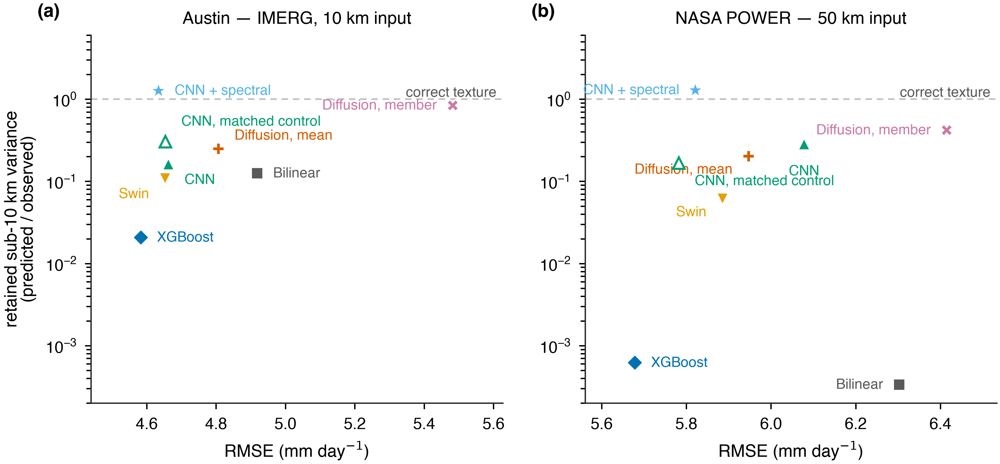

Log vertical axis; dashed line is correct texture.
Products on the left are accurate, products near the line are realistic.

---

## Where the variance is lost

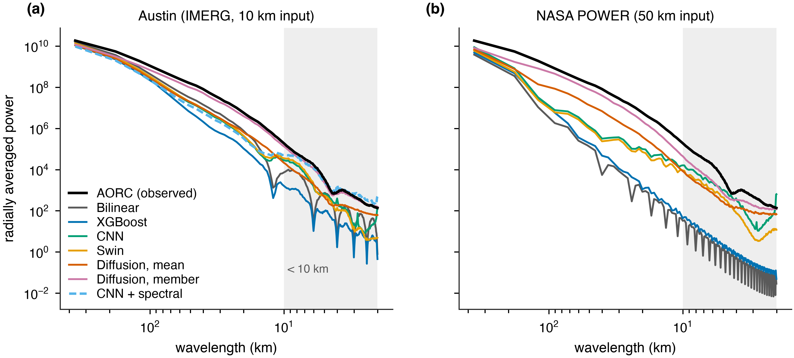

Deterministic products lose **one to two orders of magnitude** of variance below
~30 km. Shaded band is the sub-10 km range the spectral ratio summarises.

---

## What that looks like

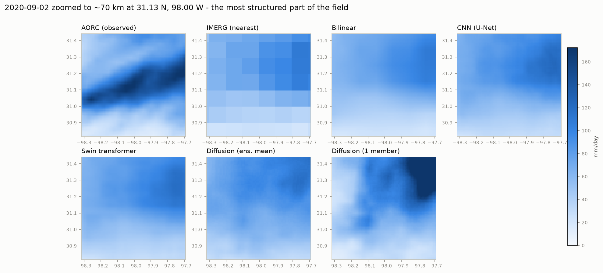

70 km window, convective day. AORC resolves a sharp rain band; the deterministic
products smooth it away; only the diffusion member carries comparable structure.

---

## Terrain: skill more than doubles

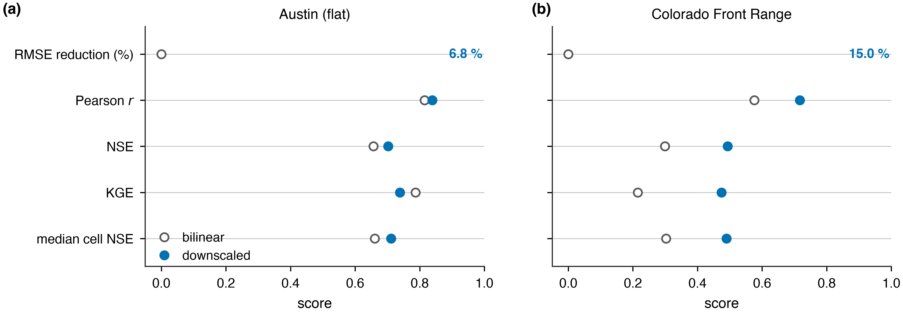

**15.0 % vs 6.8 %** RMSE reduction against bilinear.
In Colorado the model improves every metric shown; in Austin it *loses* KGE.

---

## …but terrain is not the variable. Forcing is.

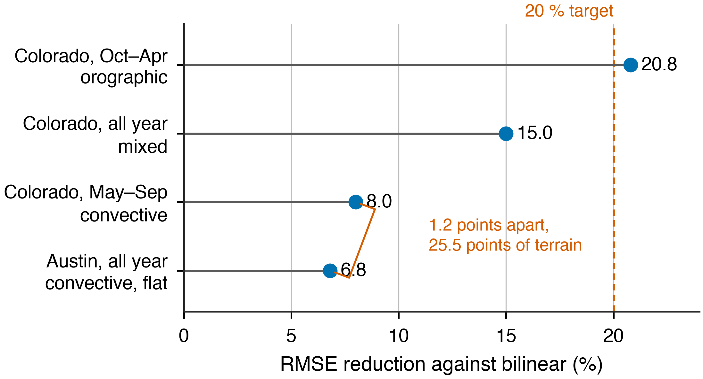

| regime | reduction |
|---|---|
| Colorado, Oct–Apr — orographic | **20.8 %** |
| Colorado, all year | 15.0 % |
| Colorado, May–Sep — convective | **8.0 %** |
| Austin, all year — convective, flat | **6.8 %** |

Warm-season Colorado lands within **1.2 points** of flat Austin — despite 25.5
percentage points more steep terrain.

---

## A coarser input: NASA POWER at 0.5°

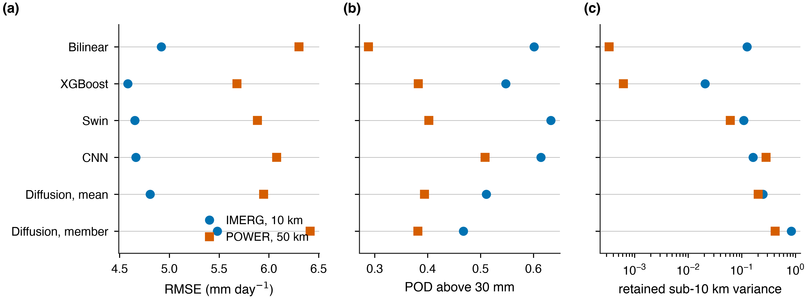

Gain rises to **9.9 %** — but the product is *worse in absolute terms* (5.679)
than bilinearly interpolating IMERG with no model at all (4.919).

**Percentage gain is not comparable across inputs of different resolution.**

---

## Where does the gain actually come from?

We claimed the coarser input lets the model recover the 10–50 km band.
We then **measured** it — Parseval partitions MSE exactly by wavelength.

| share of MSE reduction | > 100 km | 50–100 | 20–50 | 10–20 | < 10 |
|---|---|---|---|---|---|
| POWER, XGBoost | **100.3 %** | −0.2 | −0.0 | −0.0 | −0.0 |
| Austin, XGBoost | 88.5 % | 8.0 | 3.4 | 0.1 | 0.0 |

**The inference was wrong.** Essentially the entire gain is at wavelengths longer
than 100 km — domain-scale bias correction, not resolved-scale reconstruction.

It makes the paper's central claim *more* literal, not less.

---

## How large a difference is interpretable?

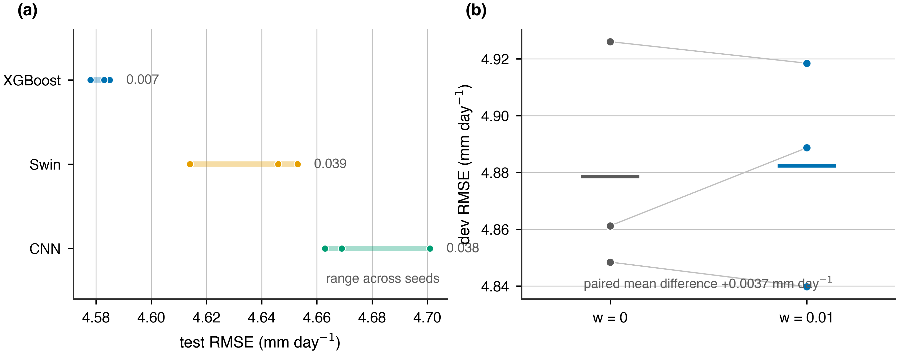

| family | seeds | spread |
|---|---|---|
| XGBoost | 4 | **0.007 (0.15 %)** |
| CNN | 3 | 0.037 (0.80 %) |
| Swin | 3 | 0.039 (0.84 %) |

The published CNN–Swin gap of 0.010 **understated** a real difference of 0.040
that holds in 9 of 9 pairwise comparisons. Single runs mislead *in both directions*.

---

## Capacity and architecture do not matter

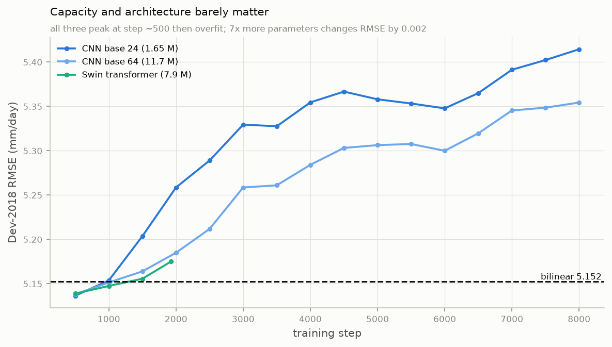

A **7× parameter increase** and a change of inductive bias from convolution to
windowed attention move dev RMSE by **0.0024 mm day⁻¹ (0.05 %)**.

---

## What *did* move the numbers: information

| intervention | effect on test RMSE |
|---|---|
| ERA5 environmental predictors | **−2.2 %** |
| record extended 4 → 18.5 years | **−2.0 %** |
| sub-daily structure features (27 → 31 channels) | **−1.5 %** |

Margin over bilinear moved 5.4 % → 6.8 %.

`cond_intensity` ranks 4th of 31 and `wet_frac` 5th in Austin — above every ERA5
field — and they transfer to Colorado (3rd and 8th).

---

## Negative results that matter

**The 1 km residual stage was auto-rejected 8 times**, in both domains, including
the orographic season where terrain ranks 1st and 2nd in its importances and the
gain is consistently positive — but only 0.2–0.4 %.

**Stacking did not transfer.** NNLS blend beat its best member on dev by 0.036,
then *lost* on test (4.601 vs 4.583). ~365 independent dev days is not enough.

**A Colorado-trained model is 13.7 % *worse* than bilinear on Austin.** Bias
swings −0.08 → +0.35: what it learned was that *its own* retrieval runs dry, not
how orography shapes rain.

---

## New: train the spectrum, don't just report it

Every loss in the study was a **per-cell** loss — and a per-cell loss is
minimised by the conditional mean. The spectral ratio was measured and never
optimised.

$$\mathcal{L} = \mathcal{L}_{\text{MSE}} + w \cdot \big\langle (\log P_{\text{pred}} - \log P_{\text{obs}})^2 \big\rangle_{\lambda < 10\,\text{km}}$$

- Reproduces the scoring diagnostic to **7 × 10⁻¹⁶**
- **Additive** to any loss — structure is orthogonal to intensity space
- `w = 0` is byte-identical to the previous objective

---

## It is a step, not a slope

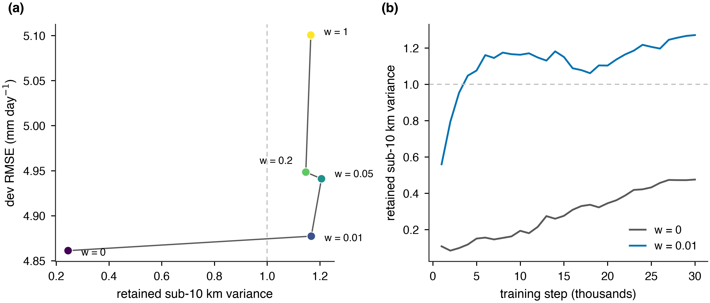

`w = 0.01` buys essentially all available texture; larger weights pay more RMSE
for nothing further.

---

## Texture at no measurable RMSE cost

| | RMSE | spectral ratio | POD>30 |
|---|---|---|---|
| IMERG 10 km, control | 4.654 | 0.303 | 0.540 |
| **IMERG 10 km, + spectral** | **4.635** | **1.260** | 0.533 |
| POWER 50 km, control | **5.782** | 0.167 | 0.391 |
| **POWER 50 km, + spectral** | 5.821 | **1.281** | **0.414** |

Three-seed paired test on dev: **+0.004 ± 0.021 mm day⁻¹**, *t* = 0.32.
Two of three seeds came out **better** with the penalty.

The penalty also **stabilises** texture: control spans 0.245–0.476 across seeds,
penalised runs span 0.988–1.112.

---

## Is it structure, or well-sized noise?

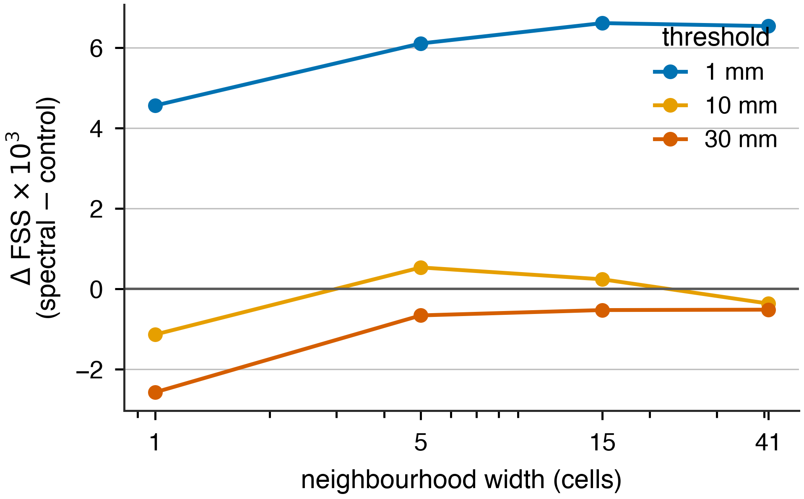

The spectral ratio is an **amplitude** diagnostic — it cannot tell them apart.
FSS can.

**1 mm improves at every width including a single cell** — noise of the right
magnitude would have *lowered* it. But the 30 mm row is uniformly, if
marginally, worse: **the added structure is light-rain structure.**

---

## The principled alternative — and why it failed

**AMSE** (Subich et al., ICML 2025) restructures MSE rather than adding to it:

```
MSE  = Σ (√PSDx − √PSDy)² + 2·√(PSDx·PSDy)·(1 − Coh)
AMSE = Σ (√PSDx − √PSDy)² + 2· max(PSDx, PSDy) ·(1 − Coh)
```

The blurring incentive is in the **coupling** — a model with poor coherence cuts
its loss by shrinking its own amplitude. Parameter-free fix.

**In our setting it costs +0.082 ± 0.037 mm (t = 3.86, 3/3 seeds) and delivers
less texture than doing nothing.** Batch-pooling the spectra makes it worse.
Fine-tuned from a trained checkpoint it is RMSE-neutral and doubles texture.

→ *AMSE does not transfer to from-scratch, patch-based limited-area training.*

---

## Post-hoc: quantile mapping

Monotone map fitted on dev, applied to test. Every cell keeps its rank.

| | RMSE | spec | POD | FAR | **CSI** | freq bias | **KGE** | wet-area |
|---|---|---|---|---|---|---|---|---|
| XGBoost | **4.583** | 0.021 | 0.548 | **0.262** | 0.458 | 0.742 | 0.739 | 1.320 |
| **+ quantile map** | 4.643 | 0.048 | **0.636** | 0.322 | **0.488** | **0.938** | **0.809** | **0.953** |

**CSI 0.488 and KGE 0.809 are the best in the study.** Cost: +0.060 mm RMSE.

Its value is **proportional to the frequency bias it corrects** — large for
XGBoost (0.742), nil for Swin (0.981).

---

## Post-hoc: probability-matched mean

Pattern from the ensemble mean, intensity distribution from the pooled members
(Ebert 2001). Six members, zero training.

**Spectral ratio 1.055** — the best-calibrated texture anywhere in the study
(distance from correct 0.055, against the spectral CNN's 0.26).

Costs RMSE (5.062) and detection (CSI 0.404).

**And: do not stack the corrections.** Quantile mapping on top of a
spectral-penalty model pushes texture to 1.74–1.90 — confirmed twice. The two
fixes are orthogonal in what they touch but over-correct in combination.

---

## Combining texture and detection

Spectral penalty + heavy-day ×3 — the two interventions that each worked alone.
**Test set, three seeds, paired against the matched control.**

| | RMSE | spectral ratio | POD | CSI |
|---|---|---|---|---|
| control (MSE) | 4.655 ± 0.007 | 0.378 ± 0.083 | 0.531 ± 0.011 | 0.442 ± 0.007 |
| + spectral | 4.675 ± 0.012 | 1.056 ± 0.080 | 0.522 ± 0.005 | 0.438 ± 0.003 |
| **+ spectral + heavy ×3** | **4.654 ± 0.007** | **1.027 ± 0.100** | **0.594 ± 0.006** | **0.463 ± 0.001** |
| + heavy-*conditioned* | 4.638 ± 0.019 | 1.893 ± 0.153 | 0.539 ± 0.011 | 0.446 ± 0.006 |

ΔRMSE **−0.001 (t = −0.2)** · ΔPOD **+0.063 (t = 11.4)** · ΔCSI **+0.021 (t = 6.3)**

Day-block bootstrap over 731 days: ΔPOD **[+0.031, +0.075]**, ΔCSI **[+0.0002, +0.036]**.

---

## Two corrections this forced

**The spectral penalty alone costs detection.** On dev it looked free; on test POD
falls in all three seeds (−0.0096, *t* = −2.68). The heavy-term is not a bonus —
it is what *repairs* a real cost.

**Heavy-*conditioning* the penalty fails at its design goal.** Texture 1.893,
detection gain not significant. Restricting it to heavy crops starves it of the
light-rain samples that anchor the spectrum.

**And a reproducibility caveat:** two runs with identical seed and settings gave
4.8772 and 4.8887 with the penalty on, while `w = 0` reproduced to the digit.
GPU FFT reductions are not deterministic — single-run comparisons are unsafe here.

## A menu, not a winner

| if you need… | use | because |
|---|---|---|
| lowest error | **XGBoost** | RMSE 4.583 |
| detection | **XGBoost + quantile map** | CSI 0.488, KGE 0.809 |
| structure *and* detection | **spectral + heavy ×3** | texture ≈ 1.05, POD 0.65 |
| realistic field | **PM mean of diffusion** | texture 1.055, no training |
| calibrated uncertainty | **diffusion ensemble** | CRPS 1.050 (28 % better) |

The conditional mean, a draw from the conditional distribution, and an upper
quantile are **three different estimators serving three different decisions**.

---

## A caveat on the reference

AORC changes precipitation methodology **inside our record**:

| period | primary daily CONUS source | adjustment |
|---|---|---|
| 1979–2001 | NLDAS-2 (CPC gauges) | strong monthly constraint |
| 2002–2015 | Stage IV radar | constraint weakens |
| **2016–** | Stage IV radar | **none** |

Training is almost entirely in the adjusted era; **dev and test are entirely
outside it**.

We measured the reference against itself year by year: **no era-to-era step
exceeds one standard deviation of interannual variability.** Splits kept.

---

## What we conclude

**Skill tracks orographic forcing, not terrain and not capacity.**
The ladder 20.8 → 15.0 → 8.0 → 6.8 is monotone in how deterministically terrain
decides where rain lands, and *not* monotone in how much terrain is present.

**What is recoverable is coarse-scale and domain-specific.**
Measured by band, ~100 % of the gain sits above 100 km. Cross-domain transfer is
13.7 % *worse* than interpolation.

**The literature's 15–25 % figures are regime statements, not method statements.**
Our Colorado cool season reproduces them with gradient-boosted trees.

**Effective sample size is ~1,100 wet weather days** — not 970 M grid cells.

---

## And one claim we had to revise

We argued accuracy and realism **cannot** be jointly maximised.

That was true of every objective we had tried — all of them per-cell losses,
with the spectrum measured and never optimised.

Once the spectrum enters the objective, a **deterministic** CNN reaches
realistic texture at better RMSE than bilinear, where previously that required a
diffusion model at +11 % RMSE.

**What survives:** a generative model is still required for a calibrated
*distribution*. It is no longer required for realistic *texture*.

---

## Limitations

1. **Two domains, not a survey** — the seasonal split is the stronger evidence
2. **Deep models on the flat domain only** for the regime comparison
3. **Seeds lightly powered** — 3 per family; complete separation can only reach *p* = 0.05
4. **Snow confounds Colorado's cool season** — most forced *and* most retrieval-degraded
5. **Daily resolution** — sub-daily is where structural information is richest
6. **The spectral penalty overshoots** (≈1.3 vs target 1.0) and its checkpoint is selected on RMSE alone
7. **POD ≥ 0.80 is unreachable** from a daily 10 km input — bilinear already gives 0.601 and our best is 0.65

---

## Future work

**Near term**
- Per-seed test scoring with day-block bootstrap *(running)*
- A **spectral floor** in checkpoint selection — the analogue of the POD floor;
  selection moved outcomes more than architecture did
- Fix the overshoot: patch-size-matched or one-sided penalty

**Experimental design**
- **Perfect-input oracles** — coarsen AORC itself to 0.1° and 0.5°, separating
  information lost to resolution from error in the input product
- **Pre-2000 evaluation** — the actual POWER use case, and a free test of
  effective sample size on a 40-year record

**Method**
- Diffusion on the XGBoost mean + probability matching
- A **distributional head** (Bernoulli–gamma), making POD a tunable dial
- Sub-10 km convective input (e.g. PERSIANN-CCS-CDR) — likely worth more for
  detection than any loss function

---

## Reproducibility

**Code** — `src/`: acquisition and alignment, feature store, `deep/` (CNN, Swin,
diffusion, spectral objective), comparison, post-processing, figures

**Configs** — one YAML per domain; `evaluation.bbox` restricts scoring
independently of training extent, which is what makes the transfer tests controlled

**Hardware** — NVIDIA GH200 (TACC Vista) and A100/H100 (Lonestar6); the tree
pipeline is CPU-only. Deep models train in 0.5–3 GPU-hours

**Data** — all sources public; IMERG needs a free Earthdata login

---

# Thank you

Full detail: `docs/RESEARCH_PAPER.md`
Metric definitions: `docs/METRICS.md`
Figures: `results/figures/publication/`
